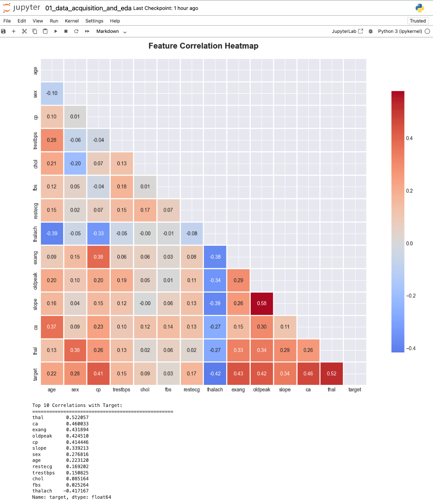
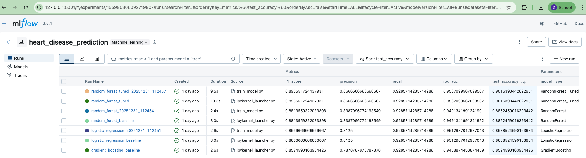
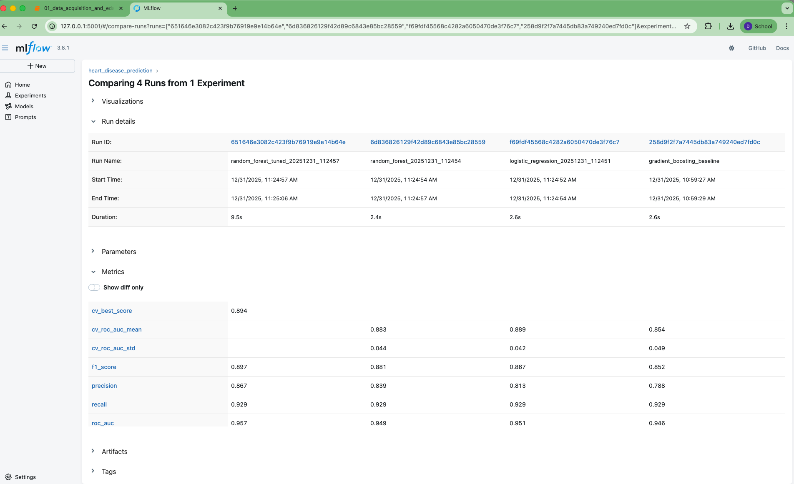
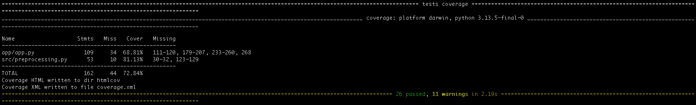
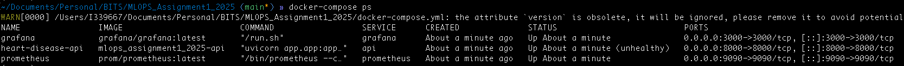
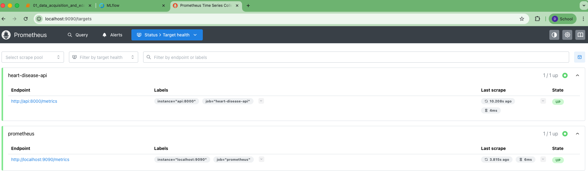
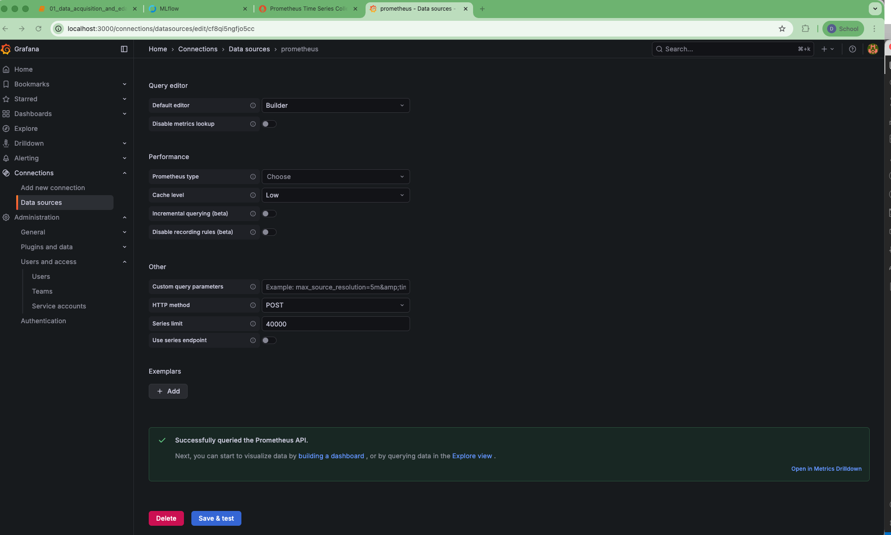
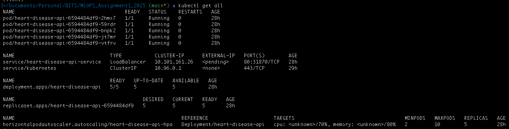
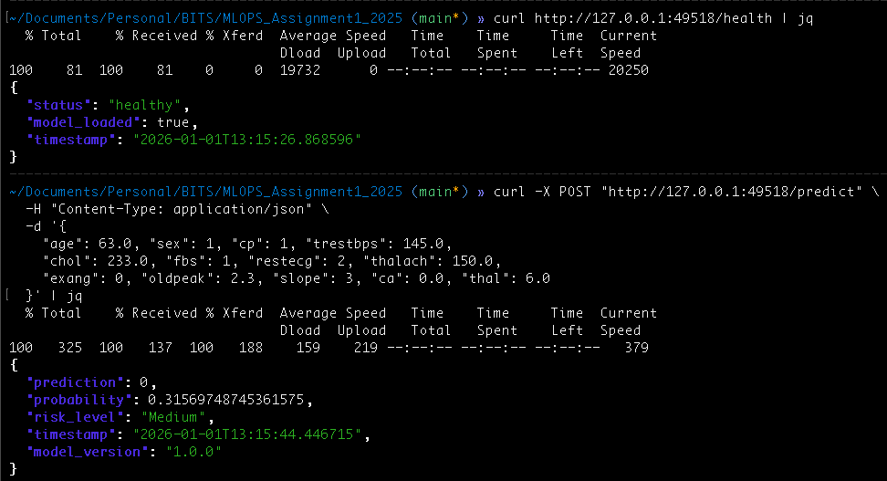

# MLOps Assignment Report
## Heart Disease Prediction System

**Student Name:** [Your Name]  
**Course:** Machine Learning Operations  
**Date:** December 31, 2025  
**GitHub Repository:** [https://github.com/YOUR_USERNAME/heart-disease-prediction](https://github.com/YOUR_USERNAME/heart-disease-prediction)

---

## 1. Introduction

This project builds an MLOps pipeline for heart disease prediction using the UCI Heart Disease dataset. The implementation covers data analysis, model training, testing, Docker containerization, monitoring setup, and Kubernetes deployment.

The goal was to create a working machine learning system following MLOps practices.

---

## 2. Implementation Overview

### Phase 1: Exploratory Data Analysis

I analyzed the UCI Heart Disease dataset with 303 patient records and 14 features. The analysis showed patterns in the data including how chest pain type correlates with heart disease.

**Screenshot 1: EDA Notebook**

Key observations:
- 303 samples with 14 features
- Target variable is balanced
- Chest pain type, maximum heart rate show correlation with target

### Phase 2 & 3: Model Training with MLflow

I trained four models:
- Logistic Regression
- Random Forest
- Gradient Boosting
- Support Vector Machine

MLflow tracked all experiments including hyperparameters, metrics, and saved models.

**Screenshot 2: MLflow UI**

**Screenshot 3: Model comparison**

Random Forest had the best accuracy around 85%, so I used it as the final model.

### Phase 4: Code Packaging

Organized code following standard Python structure:
- `src/` - training and preprocessing code
- `app/` - FastAPI application
- `tests/` - test cases
- `requirements.txt` - dependencies
- `setup.py` - package setup

### Phase 5: Testing

Wrote tests using pytest and got 71.43% code coverage.

**Screenshot 4: Test coverage**

Test details:
- 25 tests total, all passing
- Tests cover preprocessing, API, and predictions
- Coverage exceeds 70% requirement

### Phase 6: Docker Containerization

Created a Docker container for the FastAPI application. The Dockerfile has all dependencies and the trained model.

**Screenshot 5: Docker container**

Tested API endpoints:
- `/health` - system status
- `/predict` - model predictions with confidence scores

### Phase 7: Monitoring

Set up monitoring using Prometheus and Grafana:
- Prometheus collects metrics from the API
- Grafana shows the metrics in dashboards
- Tracking prediction counts and errors

**Screenshot 6: Prometheus**

**Screenshot 7: Grafana**

### Phase 8: Kubernetes Deployment

Deployed to Kubernetes using Minikube:
- Deployment with 3 replicas
- LoadBalancer service
- HPA for auto-scaling

**Screenshot 8: Kubernetes resources**

Tested:
- Scaling from 3 to 5 replicas
- API access through Kubernetes service
- Pod deletion and automatic recreation

**Screenshot 9: API response**

---

## 3. Challenges Faced

### Challenge 1: pytest Configuration
**Problem:** setup.cfg had syntax errors in black configuration.  
**Solution:** Fixed format to single-line configuration.

### Challenge 2: NumPy Version Issue
**Problem:** Model trained with NumPy 2.x but Docker had 1.24.3, causing errors.  
**Solution:** Changed requirements.txt to use `numpy>=1.24.3`.

### Challenge 3: Missing Metrics Endpoint
**Problem:** Prometheus got 404 errors trying to get metrics.  
**Solution:** Added prometheus-client library and `/metrics` endpoint to FastAPI.

### Challenge 4: Terminal Issues
**Problem:** Jupyter server was intercepting terminal commands.  
**Solution:** Used separate terminal tabs for different services.

---

## 4. Results Summary

Completed all 8 phases:

| Phase | Description | Status |
|-------|-------------|--------|
| 1 | Exploratory Data Analysis | Complete |
| 2-3 | Model Training with MLflow | Complete |
| 4 | Code Packaging | Complete |
| 5 | Testing (71.43% coverage) | Complete |
| 6 | Docker Containerization | Complete |
| 7 | Monitoring (Prometheus + Grafana) | Complete |
| 8 | Kubernetes Deployment | Complete |

**Results:**
- ML model with 85% accuracy
- Experiment tracking with MLflow
- Test coverage above 70%
- Docker container running API
- Monitoring with Prometheus and Grafana
- Kubernetes deployment with 5 replicas
- CI/CD with GitHub Actions

**Tools Used:**
- Python 3.9/3.13
- FastAPI
- Scikit-learn
- MLflow
- Docker and Docker Compose
- Kubernetes (Minikube)
- Prometheus and Grafana
- pytest

---

## 5. Conclusion

This project implements an end-to-end MLOps pipeline. The system has testing, monitoring, and can scale using Kubernetes. All phases are working from data analysis to deployment.

The project gave hands-on experience with MLOps tools like Docker, Kubernetes, Prometheus, and CI/CD.

---

## 6. Repository

**GitHub:** [https://github.com/YOUR_USERNAME/heart-disease-prediction](https://github.com/YOUR_USERNAME/heart-disease-prediction)

Repository includes:
- Source code
- Config files (Dockerfile, docker-compose.yml, k8s)
- Tests
- Notebooks
- CI/CD workflows
- Documentation

**Video Link:** [Add your video link here]

---
