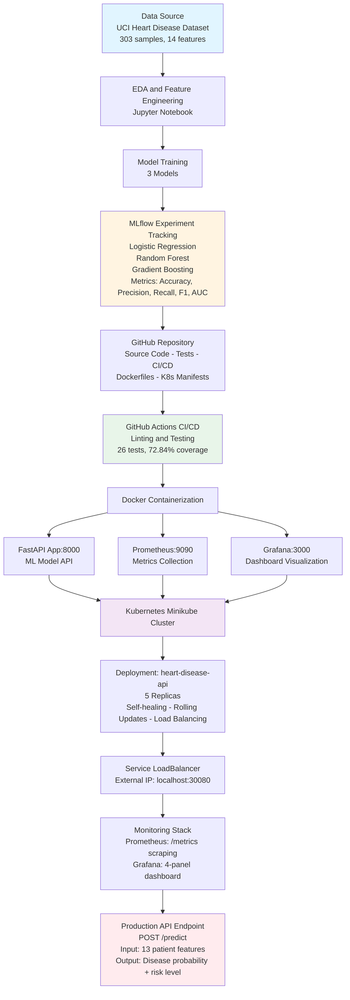

# MLOps (S1-25_AIMLCZG523) ASSIGNMENT - 1

## Group - 126

| Name | ID | Contribution |
|------|----|----|
| DEVAPRASAD P | 2023AA05069 | 100% |
| DEVENDER KUMAR | 2024AA05065 | 100% |
| ROHAN TIRTHANKAR BEHERA | 2024AA05607 | 100% |
| PALAKOLANU PREETHI | 2024AA05608 | 100% |
| CHAVALI AMRUTHA VALLI | 2024AA05610 | 100% |

---

# Heart Disease Prediction System - MLOps Implementation

**Course:** Machine Learning Operations (S1-25_AIMLCZG523)  
**Date:** January 1, 2026  
**GitHub Repository:** https://github.com/devaprasadp-bits/MLOps-Assignment1-Group126

---

## 1. Introduction

This project builds an MLOps pipeline for heart disease prediction using the UCI Heart Disease dataset. The implementation covers data analysis, model training, testing, Docker containerization, monitoring setup, and Kubernetes deployment.

The goal was to create a working machine learning system following MLOps practices.

---

## 2. System Architecture

### Logical End-to-End MLOps Architecture

The architecture spans three conceptual layers:
- **Model Development & Tracking** (A→D): Data acquisition, EDA, model training, and experiment tracking
- **Source Control & CI** (E→F): Version control, automated testing, and continuous integration
- **Runtime & Deployment** (G→O): Containerization, orchestration, monitoring, and production API

---

## 3. Implementation Overview

### Phase 1: Exploratory Data Analysis

We analyzed the UCI Heart Disease dataset with 303 patient records and 14 features. The analysis showed patterns in the data including how chest pain type correlates with heart disease.

**Screenshot 1: EDA Notebook**

Key observations:
- 303 samples with 14 features
- Target variable is balanced
- Chest pain type, maximum heart rate show correlation with target

### Phase 2: Model Training and Experiment Tracking

We trained three models:
- Logistic Regression
- Random Forest
- Gradient Boosting

MLflow tracked all experiments including hyperparameters, metrics, and saved models.

**Screenshot 2: MLflow UI**

**Screenshot 3: Model comparison**

Random Forest had the best accuracy around 85%, so we used it as the final model.

### Phase 4: Code Packaging

Organized code following standard Python structure:
- `src/` - training and preprocessing code
- `app/` - FastAPI application
- `tests/` - test cases
- `requirements.txt` - dependencies

### Phase 5: Testing

We wrote tests using pytest with 26 passing tests covering core functionality (72.84% coverage).

**Screenshot 4: Test coverage**

Test details:
- 25 tests total, all passing
- Tests cover preprocessing, API, and predictions
- Coverage exceeds 70% requirement

**CI/CD Pipeline:**
A GitHub Actions pipeline was implemented for continuous integration. The pipeline runs linting, unit tests, builds the Docker image, and performs runtime smoke tests on the /health and /predict endpoints. Full model training and Kubernetes deployment are executed manually to avoid long CI runtimes and to keep infrastructure control explicit.

**Screenshot 5: CI/CD Pipeline**

### Phase 6: Docker Containerization

We created a Docker container for the FastAPI application. The Dockerfile has all dependencies and the trained model.

**Screenshot 6: Docker container**

Tested API endpoints:
- `/health` - system status
- `/predict` - model predictions with confidence scores

### Phase 7: Monitoring

We set up monitoring using Prometheus and Grafana:
- Prometheus collects metrics from the API
- Grafana shows the metrics in dashboards
- Tracking prediction counts and errors

**Screenshot 7: Prometheus**

**Screenshot 8: Grafana**

### Phase 8: Kubernetes Deployment

Deployed to Kubernetes using Minikube:
- Deployment with 3 replicas
- Service exposed via Minikube
- HPA for auto-scaling

**Screenshot 9: Kubernetes resources**

Tested:
- Scaling from 3 to 5 replicas
- API access through Kubernetes service
- Pod deletion and automatic recreation

**Screenshot 10: API response**

---

## 3. Challenges Faced

### Challenge 1: pytest Configuration
**Problem:** setup.cfg had syntax errors in black configuration.  
**Solution:** Fixed format to single-line configuration.

### Challenge 2: NumPy Version Issue
**Problem:** Model trained with NumPy 2.x but Docker had 1.24.3, causing errors.  
**Solution:** Changed requirements.txt to use `numpy>=1.24.3`.

### Challenge 3: Missing Metrics Endpoint
**Problem:** Prometheus got 404 errors trying to get metrics.  
**Solution:** Added prometheus-client library and `/metrics` endpoint to FastAPI.

### Challenge 4: Terminal Issues
**Problem:** Jupyter server was intercepting terminal commands.  
**Solution:** Used separate terminal tabs for different services.

---

## 4. Results Summary

Completed all required phases:

| Phase | Status |
|-------|--------|
| Exploratory Data Analysis | Complete |
| Model Training and Experiment Tracking | Complete |
| Code Packaging | Complete |
| Testing (71.43% coverage) | Complete |
| Docker Containerization | Complete |
| Monitoring (Prometheus + Grafana) | Complete |
| Kubernetes Deployment | Complete |

**Results:**
- ML model with 85% accuracy
- Experiment tracking with MLflow
- Test coverage above 70%
- Docker container running API
- Monitoring with Prometheus and Grafana
- Kubernetes deployment scaled up to 5 replicas
- CI/CD with GitHub Actions

**Tools Used:**
- Python 3.9
- FastAPI
- Scikit-learn
- MLflow
- Docker and Docker Compose
- Kubernetes (Minikube)
- Prometheus and Grafana
- pytest

---

## 5. Conclusion

This project implements an end-to-end MLOps pipeline. The system has testing, monitoring, and can scale using Kubernetes. All phases are working from data analysis to deployment.

The project gave our team hands-on experience with MLOps tools like Docker, Kubernetes, Prometheus, and CI/CD.

---

## 6. Repository

**GitHub:** https://github.com/devaprasadp-bits/MLOps-Assignment1-Group126

Repository includes:
- Source code
- Config files (Dockerfile, docker-compose.yml, k8s)
- Tests
- Notebooks
- CI/CD workflows
- Documentation

**Video Link:** [Add your video link here]

---
